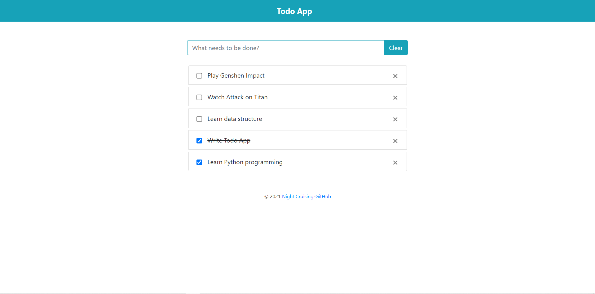

# todo-app

*A simple todo app implemented with [Yew](https://github.com/yewstack/yew).*



## Usage

clone:
```
git clone https://github.com/night-cruise/todo-app.git
cd todo-app
```

Use [trunk](https://trunkrs.dev/) to build program:
```
trunk serve --open
```

## LICENSE

This project is licensed under the MIT License (see the [LICENSE](LICENSE) file for details).